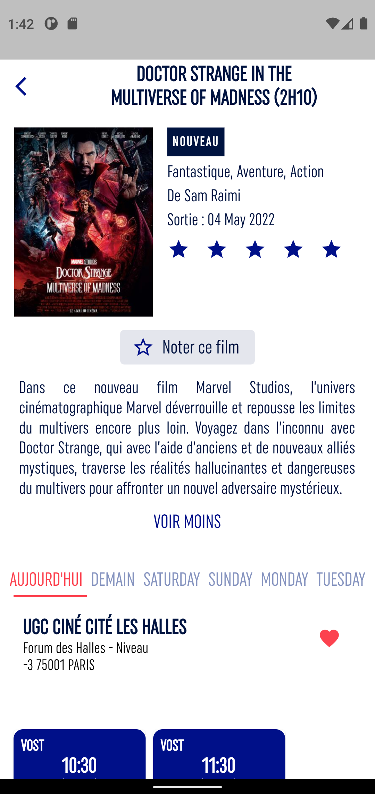

# About UGC Clone App

I made this clone of cinemas UGC app to improve my flutter and firebase skills.

I add an administrator interface to easily <strong>add, update and remove</strong> films or cinemas.

find here the original website : 

## Getting Started

To get a local copy up and running follow these simple steps.

### Prerequisites

you need a complete version of flutter installed on your computer and an emulator of ios or android device.

### Install
Clone this repo : https://github.com/menel972/UGC-flutter-app.git

run :

$ flutter pub get

$ flutter run
